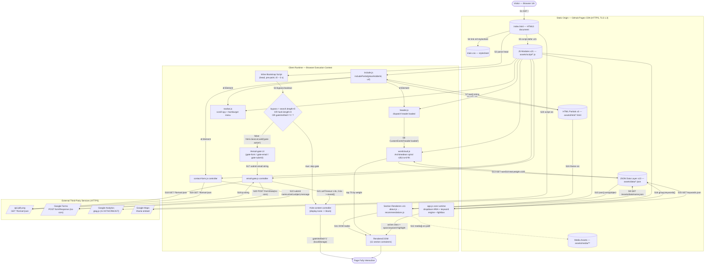

# ainlamyae.github.io

Personal resume / portfolio website
---

## Architecture Overview

The site is a statically-served, data-driven multi-page site built entirely on vanilla
HTML, CSS, and JavaScript — no build toolchain, framework, or runtime dependencies.

Two complementary patterns keep it maintainable:

- **Content–logic separation.** Every resume section (Experience, Education, Publications,
  Credentials, Engagement, …) is rendered at runtime by a dedicated script that fetches its
  JSON data file from `assets/data/` and constructs the DOM programmatically. Updating content
  means editing JSON, never markup or logic.
- **Shared HTML partials.** Cross-page chrome that would otherwise be copy-pasted (the navbar,
  the contact section) lives once under `assets/html/` and is fetched and injected into a
  placeholder `<div>` at runtime by `include.js` + `navbar.js` / `contact-form.js`. Editing the
  menu or the contact block means editing one file, regardless of how many pages use it.

---

## System Structure

```
.
├── index.html                    # Homepage — all resume sections, nav/contact placeholders
├── contact.html                  # Dedicated contact page (reuses the shared contact partial)
├── 404.html                      # Custom not-found page (served automatically by GitHub Pages)
├── robots.txt                    # Disallows all crawler indexing
├── favicon.ico                   # Multi-resolution favicon (16/32/48)
├── favicon-16x16.png             # Favicon — 16×16 PNG
├── favicon-32x32.png             # Favicon — 32×32 PNG
├── apple-touch-icon.png          # Favicon — 180×180 PNG (iOS/Safari)
├── assets
│   ├── style
│   │   └── main.css              # Design tokens, layout, component styles, animations, print rules
│   ├── script
│   │   ├── utils.js              # Shared utilities: formatDate(), calculateDuration()
│   │   ├── include.js            # Generic fetch-and-inject helper for HTML partials
│   │   ├── navbar.js             # Loads navbar partial; wires scroll-spy + mobile hamburger menu
│   │   ├── header.js             # Loads header partial; dispatches "header:loaded" when ready
│   │   ├── footer-year.js        # CSP-safe external footer "© <year>" updater
│   │   ├── analytics.js          # Google Analytics (gtag) bootstrap
│   │   ├── about.js              # About renderer — summary + skill/expertise tag groups
│   │   ├── wordcloud.js          # Word cloud renderer — freeform layout in the header
│   │   ├── education.js          # Education renderer — degree/thesis/supervisor/course-list details
│   │   ├── experience.js         # Experience renderer — org grouping, role/position dropdowns
│   │   ├── publications.js       # Publications renderer
│   │   ├── projects.js           # Projects renderer
│   │   ├── certifications.js     # Certifications renderer — grouped by type, sorted by date
│   │   ├── awards.js             # Awards renderer
│   │   ├── scores.js             # Test scores renderer
│   │   ├── volunteering.js       # Volunteering renderer
│   │   ├── recommendations.js    # Recommendations renderer
│   │   ├── contact-form.js       # Loads contact partial; Google Form submission + status messaging
│   │   ├── email-gate.js         # Bare-URL interstitial: email input + verification widget, logs lead via Google Form, then reveals #site-content
│   │   ├── ui-controls.js        # Floating action buttons: back-to-top, theme toggle, expand/collapse all
│   │   └── app.js                # Core runtime: dropdowns (ARIA), keyword engine, lightbox modal
│   ├── html
│   │   ├── navbar.html           # Shared <nav> markup, injected into #navbar-placeholder
│   │   ├── header.html           # Shared <header> markup (name, QR/social links, word cloud overlay)
│   │   └── contact.html          # Shared <section id="contact"> markup (form, map, social links)
│   ├── analysis
│   │   └── wordcloud.py          # Stdlib-only script: scans assets/data/*.json for the most
│   │                              # frequent terms and writes candidates to wordcloud.json
│   ├── data
│   │   ├── about.json            # About summary + skill/expertise tag groups
│   │   ├── experience.json       # Work history — organizations, roles, items, media
│   │   ├── education.json        # Academic history — degrees, theses, supervisors, courses
│   │   ├── publications.json     # Publication records
│   │   ├── projects.json         # Project records
│   │   ├── certifications.json   # Certification records with type, date, file
│   │   ├── awards.json           # Award records with institution, date, file
│   │   ├── scores.json           # Standardized test score records
│   │   ├── volunteering.json     # Volunteering records
│   │   ├── recommendations.json  # Recommendation records
│   │   ├── people.json           # Directory of people — instructors, collaborators, co-authors, students
│   │   ├── keywords.json         # Keyword groups mapped to URL query parameters
│   │   └── wordcloud.json        # Curated {text, weight} entries rendered as the header word cloud
│   └── media
│       ├── award/                # Award certificates (JPG, PDF)
│       ├── certification/        # Certification images (JPG)
│       ├── education/            # Education-related media (course PDFs, etc.)
│       ├── experience/           # Experience-related media
│       ├── logo/                 # Institution/employer logos
│       ├── projects/             # Project media
│       └── publication/          # Publication media
└── README.md
```

---

## Page Map & Sections

`index.html` is the single-page homepage; its sections (and nav anchors) are:

`#about` · `#experience` · `#education` · `#publications` · `#credentials` · `#engagement` · `#contact`

- **Credentials** groups Certifications, Awards, and Language/Test Scores.
- **Engagement** groups Projects, Volunteering, and Recommendations.

`404.html` and `contact.html` are standalone pages that share the same navbar. Because they
don't contain the homepage's sections, `navbar.js` rewrites the `#about`/`#experience`/…
anchors on those pages to `/index.html#about`, `/index.html#experience`, … so the links always
land on the right section instead of just changing the URL hash in place.

---

## Shared Partials (`assets/html/`)

To avoid duplicating markup across `index.html`, `404.html`, and `contact.html`:

- A page declares a placeholder, e.g. `<div id="navbar-placeholder"></div>` or
  `<div id="contact-placeholder"></div>`.
- `include.js` exposes `includePartial(placeholderId, url)`, which fetches the partial,
  parses it, and replaces the placeholder with the resulting element — returning a promise
  that resolves to the inserted element.
- `navbar.js` calls `includePartial('navbar-placeholder', '/assets/html/navbar.html')`, then
  wires up scroll-spy (`IntersectionObserver` highlighting the active link), the mobile
  hamburger toggle, and the cross-page anchor rewriting described above.
- `header.js` calls `includePartial('header-placeholder', '/assets/html/header.html')`, then
  dispatches a `header:loaded` event on `document` so other scripts (e.g. `wordcloud.js`) can
  safely query elements that live inside the injected header.
- `contact-form.js` calls `includePartial('contact-placeholder', '/assets/html/contact.html')`,
  then wires the `#contact-form` submit handler once the form actually exists in the DOM.

Because injection is asynchronous, any script that depends on injected markup (e.g. the
contact form, or the word cloud's header overlay) must do its DOM queries inside the
`includePartial(...).then(...)` callback (or a corresponding custom event like
`header:loaded`) rather than on `DOMContentLoaded` directly.

---

## System Architecture Diagram

Block-diagram convention follows ISO 5807 flow-chart symbology, adapted for a client-side web
system. Every arrow is a numbered interface (`S1`…`S24`); its variable/field names, types, and
values are pinned down in the Interface Control Table beneath the diagram, and shapes/units are
defined in the Legend that follows it — so the diagram, the table, and the legend together are
the complete specification (no detail lives only in prose).



### Interface Control Table

| ID | Source → Destination | Variable / field | Type | Value / expression |
|----|----------------------|-------------------|------|---------------------|
| S1 | Visitor → `index.html` | HTTP request line | — | `GET /` over HTTPS, TLS 1.3 |
| S2 | `index.html` → Bootstrap Script | inline `<script>` | — | executes at `t0 ≈ 0 s`, before first paint |
| S3 | Bootstrap Script → `GATEDEC` | `bypass` | `boolean` | `location.search.length>0 \|\| location.hash.length>0 \|\| localStorage.getItem('gateVerified')==='1'` |
| S4 | `index.html` → `main.css` | `<link rel="stylesheet">` | — | render-blocking stylesheet fetch |
| S5 | `index.html` → JS Modules | `<script defer>` ×21 | — | parsed in document order, executed after DOM parse |
| S6 | `include.js` → HTML Partials | `fetch(url)` | request | `url ∈ {navbar.html, header.html, contact.html}` |
| S7 | HTML Partials → `include.js` | `response.text()` | `string` | raw HTML, parsed via `wrapper.innerHTML` |
| S8 | `header.js` → `wordcloud.js` | `CustomEvent` | event | `'header:loaded'`, dispatched on `document` |
| S9 | Section Renderers → JSON Data Layer | `fetch('/assets/data/{name}.json')` | request | one endpoint per of 11 renderers |
| S10 | JSON Data Layer → Section Renderers | `response.json()` | `array \| object` | schema is renderer-specific (see `experience.json` shape etc.) |
| S11 | Section Renderers → DOM | `appendChild(...)` | `Element` | injected into e.g. `#experience-list`, `#about-content` |
| S12 | Section Renderers → Media Assets | `media[].src` | `string` (path) | relative path, lazy-referenced only |
| S13 | `wordcloud.js` → JSON Data Layer | `fetch('wordcloud.json')` | request | — |
| S14 | JSON Data Layer → `wordcloud.js` | `{text, weight}` | `array<object>` | `text:string`, `weight:number`; top 100 curated, top 75 rendered |
| S15 | `app.js` → JSON Data Layer | `fetch('keywords.json')` | request | fires only if `k` query param is present |
| S16 | JSON Data Layer → `app.js` | `{group, keywords}` | `array<object>` | `group:string`, `keywords:string[]` |
| S17 | `#gate-form` → `email-gate.js` | `email` | `string` | validated against `EMAIL_PATTERN = /^\S+@\S+\.\S+$/` (format only) |
| S18 | `email-gate.js` / `contact-form.js` → `api.ipify.org` | `fetch('?format=json')` | request | best-effort, fired on load, not blocking submit |
| S19 | `api.ipify.org` → caller | `ip` | `string` | IPv4/IPv6 literal; falls back to `'Unknown IP'` on failure |
| S20 | `email-gate.js` → Google Forms | `FormData` | `POST`, `mode:'no-cors'` | `entry.948123892='Visitor'`; `entry.1594061230=email`; `entry.1141855673=timestamp()+' '+ip`; `entry.2016710258='Automatic submission from the homepage gate.'` |
| S21 | `email-gate.js` → `#site-content` | `setTimeout` chain | `ms → s` | `VERIFY_DELAY_MS=1800 ms (1.8 s)` then `SUCCESS_DELAY_MS=600 ms (0.6 s)`, then `reveal()` |
| S22 | `#contact-form` → Google Forms | `FormData` | `POST`, `mode:'no-cors'` | `entry.948123892=name`; `entry.1594061230=email`; `entry.1141855673=timestamp()+' '+ip+' — '+subject`; `entry.2016710258=message` |
| S23 | `index.html` → Google Analytics | `<script src>` | — | `gtag.js`, measurement ID `G-XXTHCRWJGT` |
| S24 | Contact Partial → Google Maps | `<iframe src>` | — | permitted by CSP `frame-src 'self' https://www.google.com` |

**Additional timing constants** (source-verified, SI unit = second):

| Constant | Location | Value (ms) | Value (s, SI) | Purpose |
|----------|----------|-----------:|---------------:|---------|
| `VERIFY_DELAY_MS` | `email-gate.js` | 1800 | 1.8 | hold on spinner before showing "Verified!" |
| `SUCCESS_DELAY_MS` | `email-gate.js` | 600 | 0.6 | hold after "Verified!" before `reveal()` |
| deep-link `MutationObserver` watchdog | `app.js` | 5000 | 5.0 | stop watching for the hash-target title after this timeout |
| keyword-expand `MutationObserver` watchdog | `app.js` | 5000 | 5.0 | stop watching for async-rendered sections after this timeout |
| keyword-match highlight flash | `app.js` | 1000 | 1.0 | background-color flash reset on a matched toggle |

Favicon raster assets are specified in **pixels (px)** — the CSS reference pixel is not an SI
unit, but it is the only unit the raster format itself supports: `favicon-16x16.png` (16×16 px),
`favicon-32x32.png` (32×32 px), `apple-touch-icon.png` (180×180 px).

### Legend

| Symbol | ISO 5807 role | Meaning here |
|--------|----------------|--------------|
| `([ ])` stadium | Terminal | System boundary actor — the visitor, or the page reaching a stable end state |
| `[ ]` rectangle | Process | Executing client-side logic (a JS module or controller) |
| `[( )]` cylinder | Data store | A static file served as bytes from the origin (HTML/CSS/JS/JSON/media) |
| `{ }` rhombus | Decision | A boolean branch evaluated at runtime |
| `[/ /]` parallelogram | Input/Output | A network boundary crossing to a third-party origin |
| solid arrow | — | Synchronous or directly-awaited control/data transfer |
| dashed arrow | — | Best-effort or lazily-resolved reference (no delivery confirmation) |

Time is expressed throughout in the SI base unit **second (s)**, converting the millisecond
constants defined in source. Data volumes, where discussed, use SI-decimal **kilobytes (kB,
1 kB = 10³ B)** rather than binary KiB. Pixel dimensions are called out explicitly as the one
non-SI exception, since raster assets have no other applicable unit.

---

## Design Decisions

**Content–logic separation.** All section data lives in versioned JSON files under
`assets/data/`. Renderers read, parse, and inject into the DOM on page load. Adding or
updating any entry requires only a JSON edit.

**Single-source shared chrome.** The navbar and contact block are defined once under
`assets/html/` and reused via runtime `fetch` + DOM injection (see above), so there is exactly
one place to edit the menu or the contact form regardless of how many pages reference it.

**Progressive disclosure via collapsible dropdowns.** Experience roles/items, education
details, certifications, and awards are collapsed by default using the shared
`.dropdown-section` / `.dropdown-toggle` / `.dropdown-content` pattern. A CSS `max-height`
transition driven by an `.active` class toggle (managed in `app.js`) keeps the implementation
free of JS animation libraries, while `wireDropdownAria`/`syncDropdownAria` keep
`aria-expanded`/`aria-controls` in sync for keyboard and screen-reader users.

**Animated headings.** Section (`h3`) and role-toggle (`h4.dropdown-toggle` inside a
`.dropdown-section`) headings share a hover animation — a slight lift, a soft shadow, and a
diagonal shimmer sweep via a `::after` pseudo-element — disabled under
`prefers-reduced-motion: reduce`.

**URL-parameter keyword engine.** Appending a query parameter (e.g., `?ai`, `?robotics`)
triggers `app.js` to load `keywords.json`, match the parameter to a keyword group, auto-expand
all relevant dropdown sections with a staggered delay, and highlight matched terms in-place
using a safe text-node walk. This enables shareable, context-targeted deep links.

**Media gating.** Certificate and award thumbnails are hidden by default (`display: none`).
Presence of any query string triggers `unhideMedia()`, exposing the media layer selectively
for authenticated or invited visitors without additional server-side logic.

**Lightbox modal.** A single shared modal (`#cert-modal`) handles both image and PDF media
across all sections. Navigation between items within the same media list is managed via an
index pointer into a shared `currentMediaList` array.

**Print stylesheet.** `@media print` collapses the navbar, forces all dropdown content
visible, strips decorative backgrounds/animations, and resets typography to 11pt black —
producing a clean single-pass PDF without any separate export pipeline.

**Serverless contact form.** `contact-form.js` injects the shared contact partial, intercepts
the `#contact-form` submit, maps its fields (name/email/subject/message) to a Google Form's
`entry.*` IDs, and POSTs them to the form's `formResponse` endpoint with `mode: "no-cors"` —
letting visitors send messages without any backend, while `#contact-status` reports a
"Sending… / Thanks! / Something went wrong" status (styled via `.contact-status` /
`.contact-status.error` in `main.css`). Because the response is opaque under `no-cors`,
success here only confirms the request was sent, not that Google accepted it. The same partial
(and the same handler) powers both the in-page `#contact` section on the homepage and the
standalone `contact.html` page. On submit, the script also kicks off a best-effort lookup of the
visitor's public IP via `https://api.ipify.org` and prepends a `YYYY-MM-DD HH:MM:SS IP` stamp to
the submitted subject (e.g. `2026-07-16 23:32:32 99.251.14.181 — Job inquiry`), so responses in
the Google Sheet show who/when alongside the visitor's own subject line. If the lookup hasn't
resolved by submit time, it falls back to `Unknown IP` rather than blocking the send.

**Email-gated homepage.** Loading `index.html` with no `?query` and no `#hash` shows a
full-screen white interstitial (`#email-gate`) instead of the page content (`#site-content`),
which stays `display: none` until the gate clears. The gate/bypass decision is made by a small
inline `<script>` at the top of `<head>` — before any CSS paints — so there's no flash of
hidden content: it adds a `gate-active` class to `<html>` unless `location.search`,
`location.hash`, or a prior `localStorage.gateVerified` flag says to skip it.

The gate UI shows a heading ("Verifying you are human. / This may take a few seconds."), an
email input field, and a horizontal verification widget. The widget displays a small animated
box on its left side — initially a plain square; after the visitor clicks it the box border
disappears and is replaced by a dotted orange rotating arc spinner; on completion a green
checkmark confirms success before the gate dismisses. A secondary note below the widget reads
"We need to review the security of your connection before proceeding."

Submitting the gate's email field (validated with a basic `@`/`.` pattern — format only, not
deliverability: nothing confirms the address is real) reuses the same Google Form `no-cors`
POST as the contact form (`name: "Visitor"`, `subject: "YYYY-MM-DD HH:MM:SS IP"`, using the
same ipify lookup and `Unknown IP` fallback described above) to log the lead, then removes
`gate-active` and sets `localStorage.gateVerified` so the same browser isn't asked again. This
is a client-side filter for casual visitors and lead capture, not an access-control mechanism —
anyone can bypass it with any query string or hash, view source, or disabled JS.

**Content Security Policy.** `index.html` and `contact.html` declare a restrictive CSP via
`<meta http-equiv="Content-Security-Policy">` (self-hosted scripts/styles/fonts, plus an
allowlist for Google Analytics, Google Ads-audience, Google Forms, the embedded Google Map, and
`api.ipify.org` for the contact-form/email-gate IP lookup). Because CSP blocks inline `<script>`
execution, any per-page bootstrap logic — e.g. the footer year — lives in an external file
(`footer-year.js`) rather than an inline `<script>` block.

**Word cloud.** `assets/analysis/wordcloud.py` (stdlib only) scans every `assets/data/*.json`
file plus the comma-separated skill phrases in `about.json`, tokenizes and normalizes terms
(singular/plural, gerund, and past-tense forms collapse to one base word), and writes the top
100 `{text, weight}` candidates to `assets/data/wordcloud.json` for manual curation. At runtime,
`wordcloud.js` fetches that file, takes the top 75 by weight, and lays them out with an
Archimedean-spiral collision-avoidance algorithm — sized by weight and color-graded from
`--wc-color-high` (most frequent) to `--wc-color-low` (least frequent) via `color-mix()`. The
result is rendered at low opacity as an absolutely-positioned, non-interactive
`#wordcloud-container` overlay inside `<header>`, behind the name and QR code, so it reads as a
subtle background texture without taking up any layout space.

**Branding & crawler controls.** A monogram favicon (`favicon.ico` / PNG variants /
`apple-touch-icon.png`) is generated from the site's `--color-primary` palette and linked from
`<head>`. `404.html` and `contact.html` reuse the same shared navbar/footer chrome as the
homepage so navigation stays consistent everywhere — GitHub Pages serves `404.html`
automatically for unmatched routes on a `<username>.github.io` repo, no extra config needed.
`robots.txt` plus `<meta name="robots" content="noindex, nofollow, noarchive">` on every page
keep the site out of search indexes.

---

## License

All rights reserved. The contents of this repository are provided for viewing purposes only.
Reproduction, modification, redistribution, or reuse of any part of this codebase requires
explicit written permission from the repository owner.
